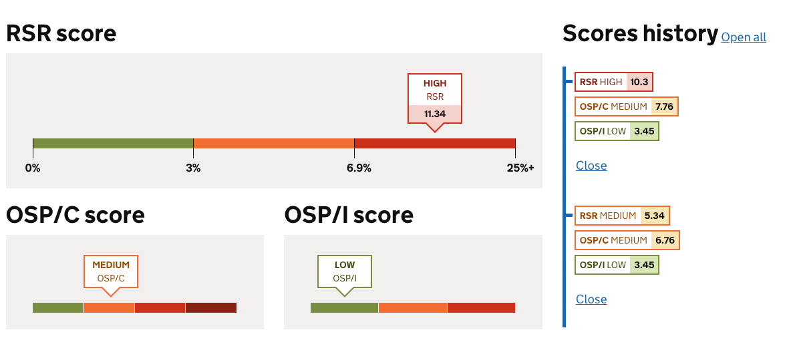
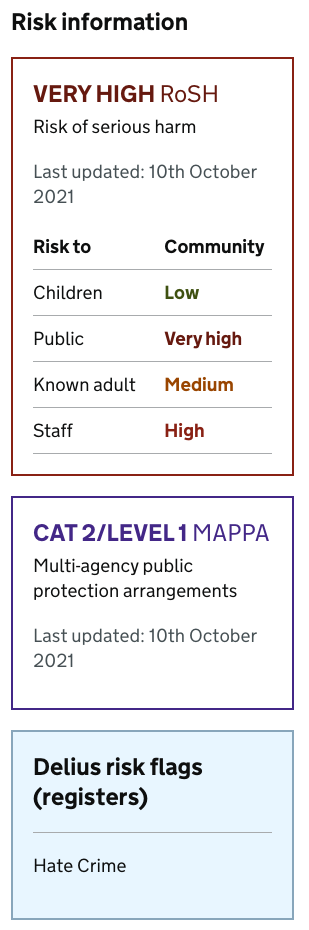
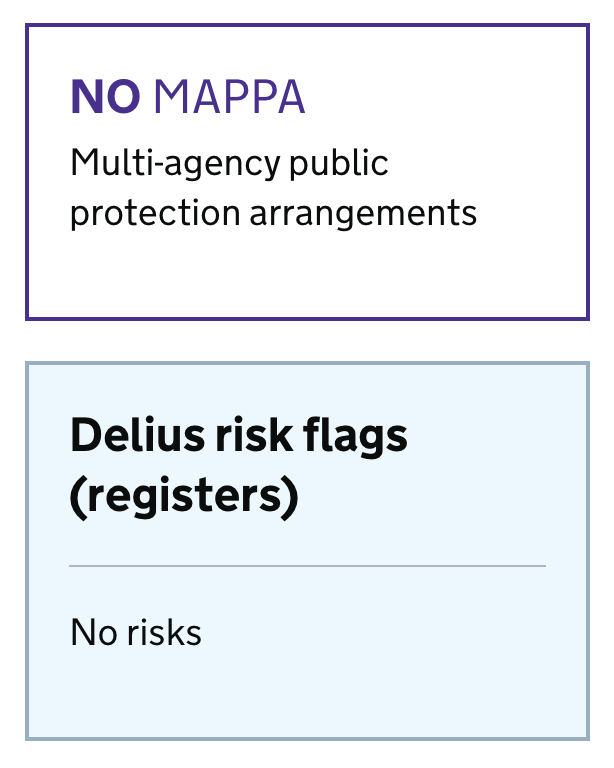
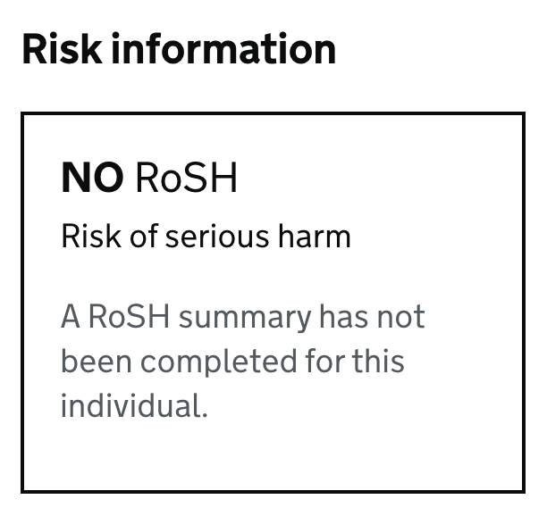
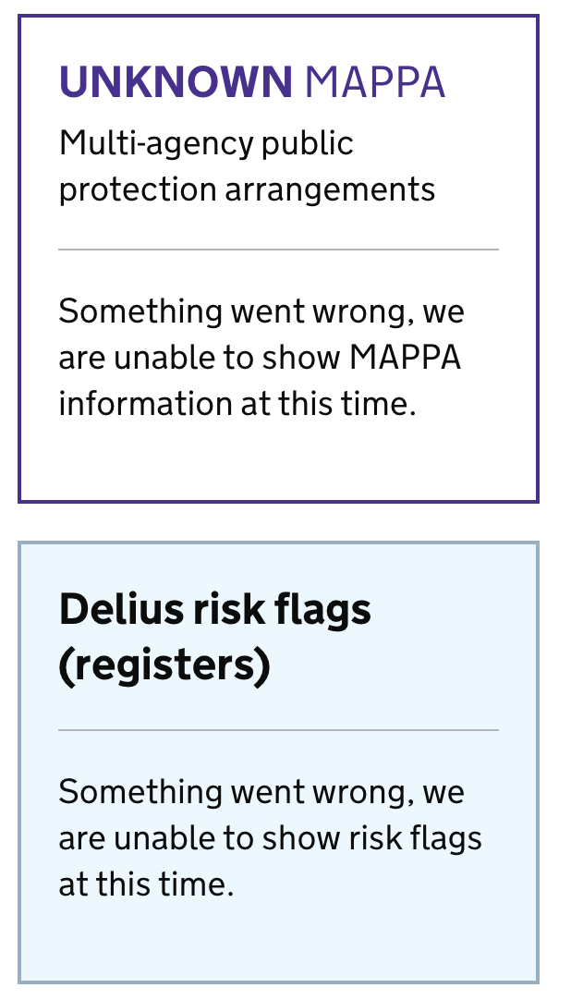
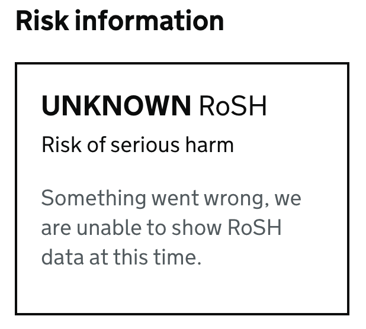

# HMPPS Risk UI elements
Templates and styles for displaying consistent risk information UI elements in HMPPS services. 

These can be used in a similar way to other components in the GOV.UK and MoJ frontend systems.

# Examples
## Risk scores

Given that the `predictorScores` data is as follows:
```
{
      current: {
        date: '23 Jul 2021 at 12:00:00',
        scores: {
          RSR: {
            level: 'HIGH',
            score: 11.34,
            type: 'RSR',
          },
          OSPC: {
            level: 'MEDIUM',
            score: 8.76,
            type: 'OSP/C',
          },
          OSPI: {
            level: 'LOW',
            score: 3.45,
            type: 'OSP/I',
          },
        },
      },
      historical: [
      {
        date: '14 May 2019 at 12:00:00',
        scores: {
          RSR: {
            level: 'HIGH',
            score: 10.3,
            type: 'RSR'
          },
          OSPC: {
            level: 'MEDIUM',
            score: 7.76,
            type: 'OSP/C'
          },
          OSPI: {
            level: 'LOW',
            score: 3.45,
            type: 'OSP/I'
          }
        }
      },
      {
        date: '12 September 2018 at 12:00:00',
        scores: {
          RSR: {
            level: 'MEDIUM',
            score: 5.34,
            type: 'RSR'
          },
          OSPC: {
            level: 'MEDIUM',
            score: 6.76,
            type: 'OSP/C'
          },
          OSPI: {
            level: 'LOW',
            score: 3.45,
            type: 'OSP/I'
          }
        }
      }
    ]
    }
```
This code would display the scores as in the screenshot below:
```



<div class="govuk-grid-row">
    <div id="predictor-scores" class="govuk-grid-column-two-thirds">
        <div class="govuk-grid-row">
            <div class="govuk-grid-column-full">
                <h2 class="govuk-heading-l score-header">RSR score</h2>
                {{ predictorScore(predictorScores.current.scores.RSR) }}
            </div>
        </div>
        <div class="govuk-grid-row">
            <div class="govuk-grid-column-one-half">
                <h2 class="govuk-heading-l score-header">OSP/C score</h2>
                {{ predictorScore(predictorScores.current.scores.OSPC) }}
            </div>
            <div class="govuk-grid-column-one-half">
                <h2 class="govuk-heading-l score-header">OSP/I score</h2>
                {{ predictorScore(predictorScores.current.scores.OSPI) }}
            </div>
        </div>
    </div>
    
    <div id="predictor-scores-history" class="govuk-grid-column-one-third">
        <div class="govuk-body predictor-timeline__heading">
            <h2 class="govuk-heading-l">Scores history</h2>
            <a id="predictor-timeline__toggle-all" href="#" class="govuk-link">Open all</a>
        </div>
        {{ predictorTimeline(predictorScores.historical) }}
    </div>
    
</div>

```


---
## Risk Widgets

Given `widgetData` that looks like this:

```
{
  "mappa": {
    "level": "CAT 2/LEVEL 1",
    "isNominal": false,
    "lastUpdated": "10th October 2021"
  },
  "flags": [
    "Hate Crime"
  ],
  "roshRiskSummary": {
    "hasBeenCompleted": true,
    "overallRisk": "VERY_HIGH",
    "riskToChildren": "LOW",
    "riskToPublic": "VERY_HIGH",
    "riskToKnownAdult": "MEDIUM",
    "riskToStaff": "HIGH",
    "lastUpdated": "10th October 2021"
  }
}
```
This code would display the risk widgets as in the screenshot below:
```


<div class="govuk-grid-column-one-quarter">
    {{ widgets(widgetData) }}
</div>
```


Where `mappa` is `{}`, `flags` are `[]` or `roshRiskSummary` is `{ hasBeenCompleted: false }` the widgets will display a notification indicating the information is unavailable for the given CRN. This is typically in response to `404` returned from upstream APIs.





Where `mappa`, `flags` or `roshRiskSummary` are `null` the widgets will display a notification indicating `Something went wrong..`. Typically this is displayed when receiving a `4XX - 5XX` error from upstream APIs - not inclusive of the `404` as mentioned above.






# Using the widgets in the prototyping kit

This guide was written against version 12.01 of the prototyping kit (https://govuk-prototype-kit.herokuapp.com/docs)

## Install the scss files
After installing the prototyping kit in the normal way, copy the files in the `scss` folder of this repo to: `app/assets/sass/risk`

Now edit `app/assets/sass/application.scss`  to import the style files after the other stylesheet imports (around line 18 when the kit is installed):

```
@import "risk/predictor-scores";
@import "risk/widgets";
@import "risk/timeline";
```

## Add the javascript file
Copy the javascript file in the `javascript` folder of this repo to: `app/assets/javascripts`. This is only used in the 'timeline' component - you can leave this file out if you're not using that component. 


## Copy and configure the templates
Copy the `components` folder and its contents from this repo into `app/views/`.

Edit `app/views/layout.html` - add the following lines after the other template import statements around line 33:

```



```

## Show the widgets on a page

You can now set up a page with the widget components and pass in data for them to use. In the `examples` folder of this repo you will find a sample `routes.js` file that shows how you might set up the data and pass it into a page called 'scores'. You can also find a corresponding `scores.html` file that shows how you might then display the widgets on the page using that data. 

# Questions and updates
This repo is maintained by the Assess Risks and Needs team in MoJ Digital. If you have any questions or update requests, please contact Karen Simpson for design queries or Paul Coupe for technical queries.

Pull Requests are welcome!
