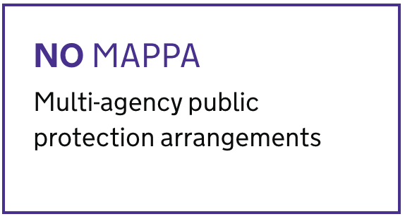

# MAPPA widget

## Arguments

|Name|Type|Required|Description|
|---|---|---|---|
|level|String|Yes|the MAPPA level that is displayed|
|isNominal|String|Yes|is MAPPA nominal?|
|lastUpdated|String|Yes|the MAPPA level that is displayed|

## Example
Below is a typical example of this component in use

```nunjucks


{{ mappaWidget({
    level: "CAT 2/LEVEL 1",
    isNominal: false,
    lastUpdated: "10th October 2021"
}) }}
```


**When there is no associated risk flags for the individual**

```nunjucks


{{ mappaWidget({}) }}
```


**When something went wrong**

```nunjucks


{{ mappaWidget(null) }}
```


##  Usage

### When to use
TODO

### When not to use
TODO

## Research
TODO
