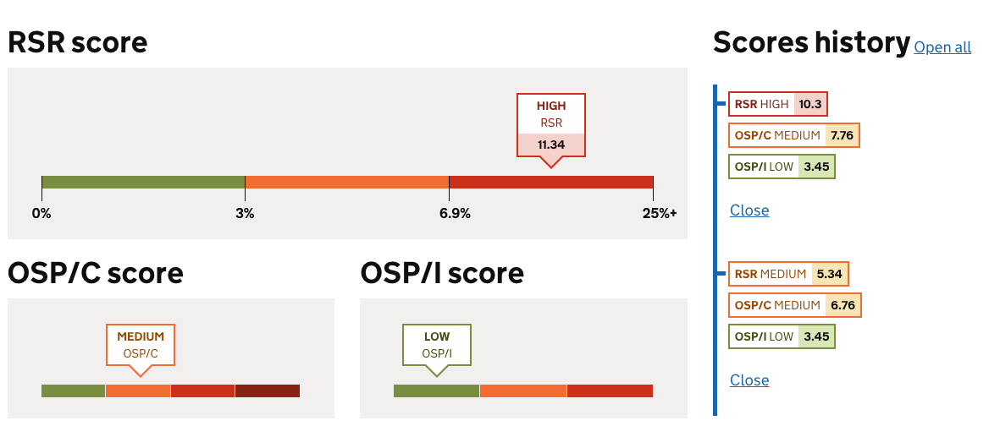

# Risk predictor scores

## Arguments

**Component**
|Name|Type|Required|Description|
|---|---|---|---|
|level|RiskLevel|Yes|the level of risk|
|score|Number|Yes|the numerical risk score|
|type|String|Yes|the risk type that will be displayed|


where risk levels can be `LOW`, `MEDIUM`, `HIGH`, or `VERY_HIGH`

## Example

**Below is a typical example of this component in use**

```nunjucks


<div id="predictor-scores">
    <div class="govuk-grid-row">
        <div class="govuk-grid-column-full">
            <h2 class="govuk-heading-l score-header">RSR score</h2>
            {{ predictorScore({
                "level": "HIGH",
                "score": 11.34,
                "type": "RSR"
            }) }}
        </div>
    </div>
    <div class="govuk-grid-row">
        <div class="govuk-grid-column-one-half">
            <h2 class="govuk-heading-l score-header">OSP/C score</h2>
            {{ predictorScore({
                "level": "MEDIUM",
                "score": 8.76,
                "type": "OSP/C"
            }) }}
        </div>
        <div class="govuk-grid-column-one-half">
            <h2 class="govuk-heading-l score-header">OSP/I score</h2>
            {{ predictorScore({
                "level": "LOW",
                "score": 3.45,
                "type": "OSP/I"
            }) }}
        </div>
    </div>
</div>
```



## Usage

### When to use
TODO

### When not to use
TODO

## Research
TODO
