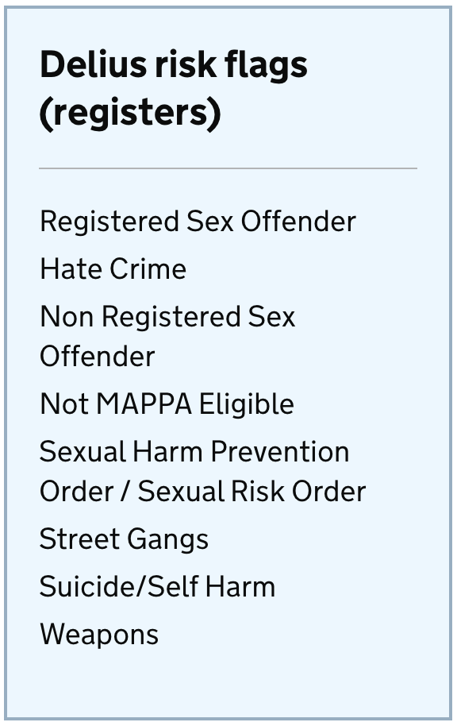
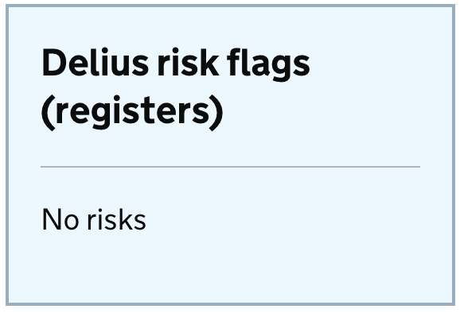
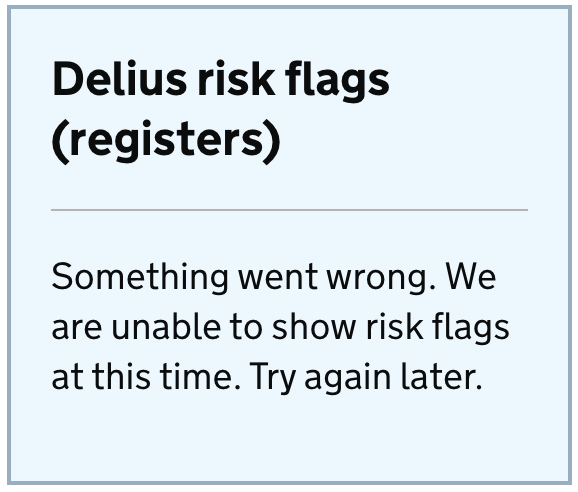

# Delius risk flag (registrations) widget

## Arguments

**Component**
|Name|Type|Required|Description|
|---|---|---|---|
|flags|Risks[]|Yes|risk flags for the widget to display|

**Risks**
|Name|Type|Required|Description|
|---|---|---|---|
|description|String|Yes|description for the risk flag|

## Example
Below is a typical example of this component in use

```nunjucks


{{ riskFlagWidget([
    { "description": "Hate Crime" },
    { "description": "Modern Day Slavery - Perpetrator" }
]) }}
```



**When there is no associated risk flags for the individual**

```nunjucks


{{ riskFlagWidget([]) }}
```


**When something went wrong**

```nunjucks


{{ riskFlagWidget(null) }}
```



##  Usage

### When to use
TODO

### When not to use
TODO

## Research
TODO
