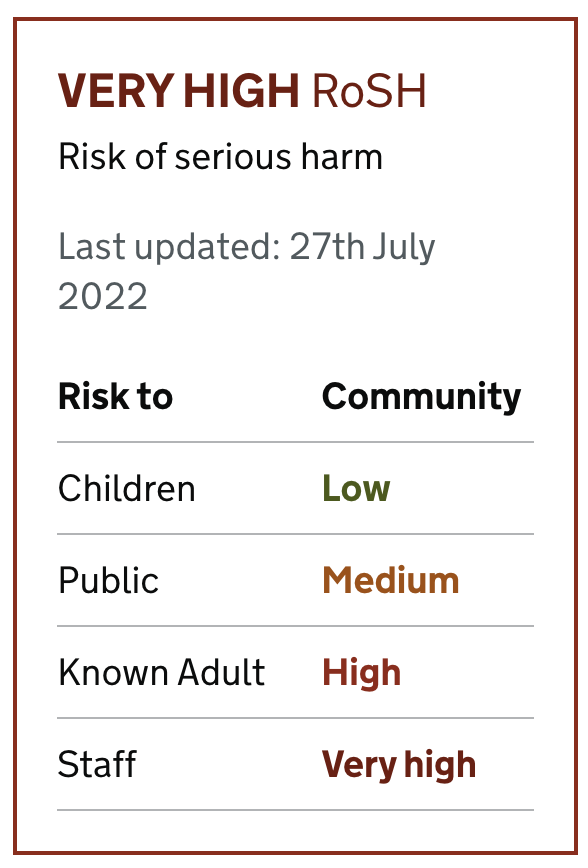
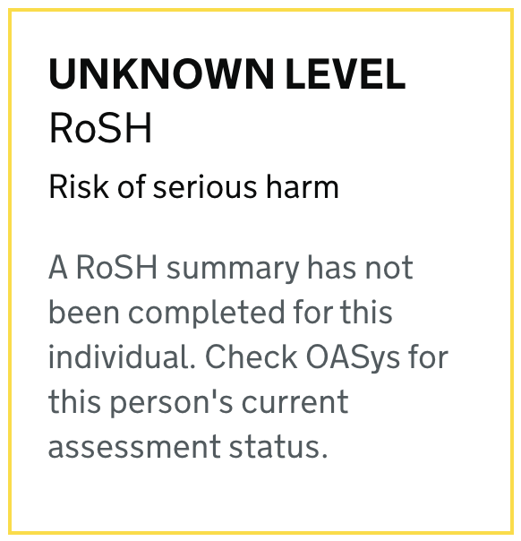
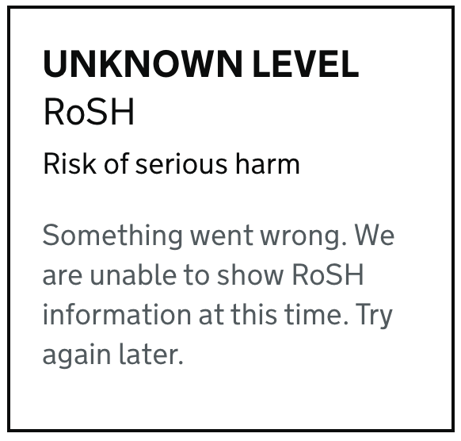

# RoSH widget

## Arguments

|Name|Type|Required|Description|
|---|---|---|---|
|hasBeenCompleted|Boolean|Yes|we set this to false if the API returns a 404 notifying the user that risk data is unavailable|
|lastUpdated|Map|Yes|when the risk data was last updated|
|overallRisk|String|Yes|the overall risk level to display|
|riskInCommunity|Map|No|risk levels in the community|
|riskInCustody|Map|No|risk levels in the community|

where risk levels can be one of `LOW`, `MEDIUM`, `HIGH`, and `VERY_HIGH`

## Example

**Below is a typical example of this component in use**

```nunjucks


{{ roshWidget({
    hasBeenCompleted: true,
    overallRisk: "VERY_HIGH",
    riskInCommunity: {
      "Children": "LOW",
      "Public": "VERY_HIGH",
      "Known Adult": "MEDIUM",
      "Staff": "HIGH"
    },
    riskInCustody: {
      "Children": "LOW",
      "Public": "VERY_HIGH",
      "Known Adult": "MEDIUM",
      "Staff": "HIGH",
      "Prisoners": "MEDIUM"
    }
    lastUpdated: "10th October 2021"
}) }}
```


**When there is no associated risk data for the individual**

```nunjucks


{{ roshWidget({
    hasBeenCompleted: false
}) }}
```


**When something went wrong**

```nunjucks


{{ roshWidget(null) }}
```



## Usage

### When to use
TODO

### When not to use
TODO

## Research
TODO
